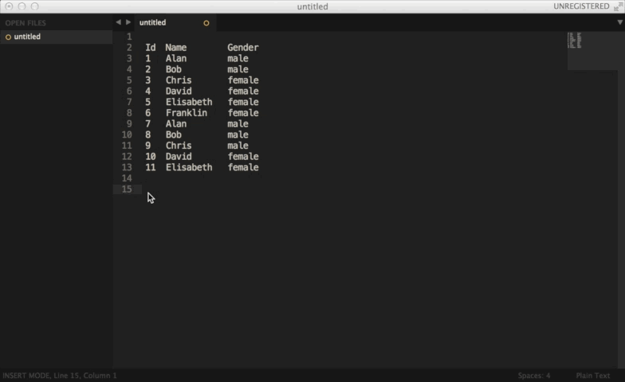

PzFormat
================

A sublime text plugin to format text.

# Installation
- Use Package Control to install
- Or you can download or clone directly and drop into your Sublime Text 3 packages directory

# Usage
## Put any type format string into clipboard
Format syntax example.
- my name is {}, come from {}.
- INSERT INTO Persons (id, name, gender) VALUES ({0}, {1}, {2});
- {0} * {0} = {1}

## Select data in sublime text
The number of columns must be equal to the number of format string parameters.
<pre>
"separator": [",","，",";"] //default separators. space is implicit included
</pre>

## Format by [<code>super+shift+o</code>,<code>super+shift+f</code>]
PzFormat will auto split data into lines and try to format each line.
